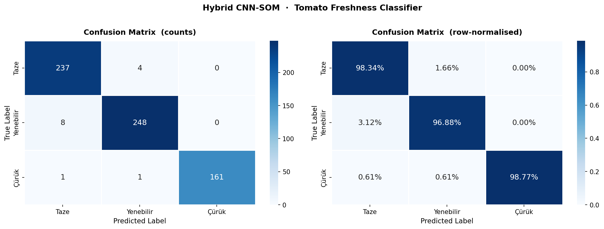
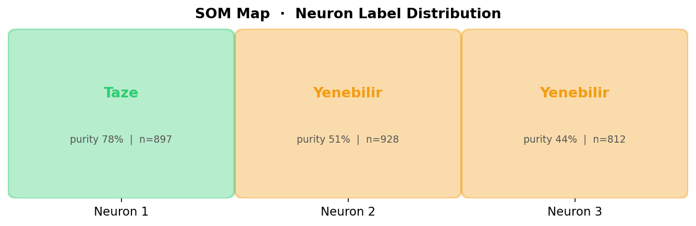
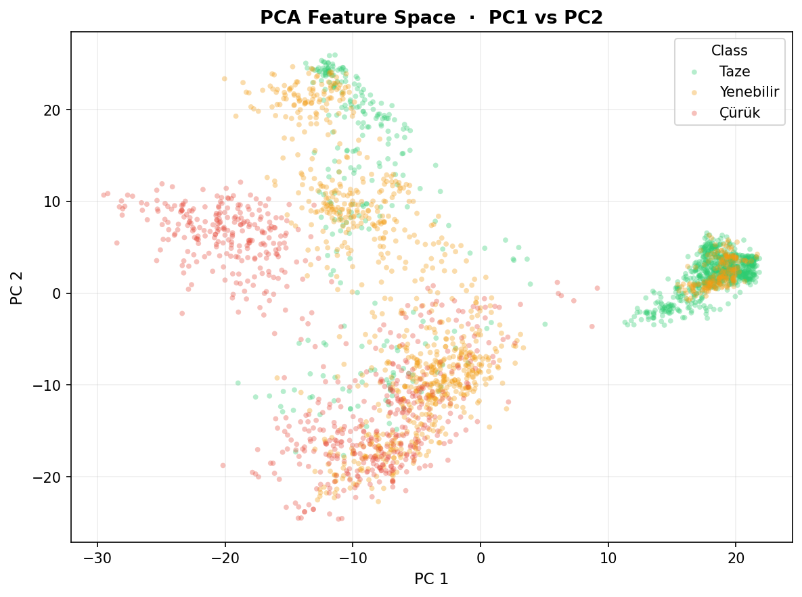

# TazeMi? — Domates Tazelik Sınıflandırıcı

Domates fotoğrafından **Taze / Yenebilir / Çürük** tahmini yapan hibrit makine öğrenmesi uygulaması.  
Yüksek lisans tez projesi olarak geliştirilmiştir.

---

## Model Mimarisi

```
Fotoğraf
  → MobileNetV2 (dondurulmuş, ImageNet)   1280-dim özellik vektörü
  → StandardScaler + PCA (64 bileşen)     boyut indirgeme
  → MiniSom (3×1)                         topoloji görselleştirmesi
  → SVM-RBF                               sınıflandırıcı
```

SOM, CNN özellik uzayını görselleştirmek için kullanılır. Sınıflandırma kararı SVM tarafından verilir — Yenebilir ve Çürük sınıfları CNN uzayında örtüştüğünden SOM tek başına yeterli değildir.

---

## Sonuçlar

| Metrik         | Değer  |
|----------------|--------|
| Test Doğruluğu | %97.9  |
| F1 (macro)     | 0.98   |
| F1 (weighted)  | 0.98   |

**Confusion Matrix**



**SOM Nöron Haritası**



**PCA Özellik Uzayı**



---

## Veri Seti

Veri seti tamamen özgündür — hazır ya da açık kaynak bir veri seti kullanılmamıştır. Domatesler satın alındıktan sonra günlük fotoğraflarla takip edilerek çürüme süreci belgelenmiş, her görsel manuel olarak etiketlenmiştir.

| Klasör   | Sınıf      | Görsel |
|----------|------------|--------|
| level_1/ | Taze       | 1.416  |
| level_2/ | Yenebilir  | 1.279  |
| level_3/ | Çürük      | 1.592  |
| **Toplam** |          | **4.287** |

Görseller repoya dahil değildir. Klasör yapısını oluşturduktan sonra eğitim scriptini çalıştırabilirsiniz.

---

## Kurulum

**Gereksinimler:** Python 3.9+, Apple Silicon veya CUDA GPU önerilir (CPU da çalışır)

```bash
git clone https://github.com/mrKYLN/food_fresh_rotten_status_classifier.git
cd food_fresh_rotten_status_classifier

python -m venv .venv
source .venv/bin/activate        # Windows: .venv\Scripts\activate

pip install -r requirements.txt
```

---

## Kullanım

**Streamlit arayüzünü başlat:**
```bash
streamlit run app.py
```

Uygulama `http://localhost:8501` adresinde açılır. Domates fotoğrafı yükleyince model tahmini ve güven skorlarını gösterir.

**Modeli eğit:**
```bash
# İlk çalıştırmada CNN özellikleri çıkarılır ve cache'lenir (~10 dk)
python train_hybrid.py

# CNN özelliklerini yeniden çıkararak eğit
python train_hybrid.py --force
```

**Claude AI yorumu (opsiyonel):**  
Anthropic API anahtarınızı `ANTHROPIC_API_KEY` ortam değişkeni olarak ayarlayın ya da arayüzden girin. Aktif olduğunda Claude Haiku Vision fotoğrafı analiz edip Türkçe yorum ve tarif önerisi üretir.

```bash
export ANTHROPIC_API_KEY="sk-ant-..."
streamlit run app.py
```

---

## Proje Yapısı

```
├── src/
│   ├── config.py             # Merkezi konfigürasyon
│   ├── data_loader.py        # Görsel yükleme ve train/test split
│   ├── feature_extractor.py  # MobileNetV2 özellik çıkarıcı
│   ├── hybrid_model.py       # HybridCNNSOM sınıfı (SOM + SVM)
│   └── evaluate.py           # Metrik ve grafik fonksiyonları
├── app.py                    # Streamlit arayüzü
├── train_hybrid.py           # Eğitim pipeline'ı
├── optimize_svm.py           # SVM hiperparametre optimizasyonu
├── models/
│   └── hybrid_cnn_som.pkl    # Eğitilmiş model
├── outputs/                  # Confusion matrix, SOM haritası, PCA grafikleri
└── requirements.txt
```

---

## Teknolojiler

- **PyTorch** — MobileNetV2 özellik çıkarma (MPS / CUDA / CPU)
- **scikit-learn** — StandardScaler, PCA, SVM
- **MiniSom** — Self-Organizing Map
- **Streamlit** — Web arayüzü
- **Anthropic Claude** — Görsel analiz ve tarif önerisi

---

## Lisans

Akademik kullanım amaçlıdır.
